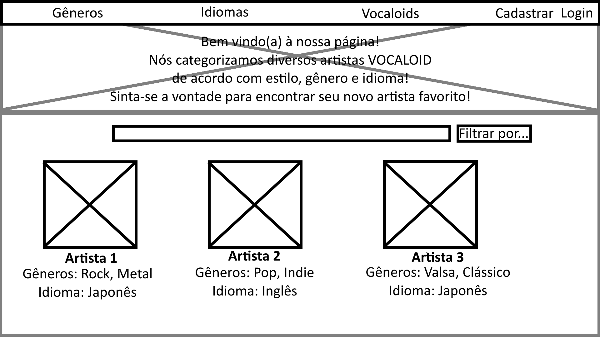
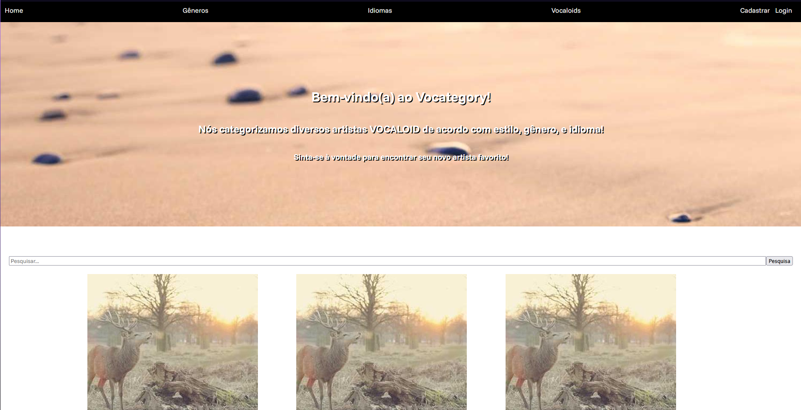

# Trabalho Prático - Semana 03

Dessa vez, vamos escolher uma proposta de projeto para trabalhar.

Nessa atividade, você deverá montar a página inicial do projeto escolhido, a organização do HTML aplicando semântica correta e uso aprimorado do CSS. Leia o enunciado completo no Canvas para mais detalhes.

**IMPORTANTE:** Você deve trabalhar e alterar apenas arquivos dentro da pasta **`public`**. Deixe todos os demais arquivos e pastas desse repositório inalterados. **PRESTE MUITA ATENÇÃO NISSO.**

## Informações Gerais

- Nome: Gabriel Katahira Cordeiro
- Matricula: 899301
- Proposta de projeto escolhida: 1. Pessoas e Produções
- Breve descrição sobre seu projeto: Um site que coleta e categoriza diversos artistas Vocaloid, de acordo com gênero, idioma e principais Vocaloids. Vocaloid é um software que é usado, principalmente por artistas japoneses, para poder sintetizar vozes para integrar em suas músicas. O software conta com diversos Vocaloids diferentes, que representam vozes diferentes.

## Print do(s) wireframe(s) criado

## Print da home-page criada

